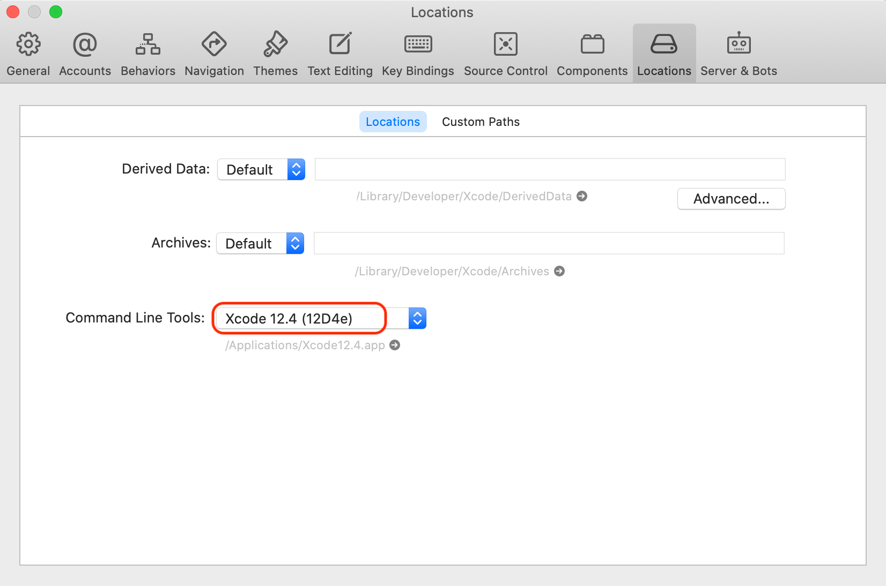

# App Tracking Transparency Dialog Plugin

This plugin presents the app-tracking authorization request dialog and get the tracking authorization status.

This is a plugin for Unreal Engine 4.

## Marketplace url

https://www.unrealengine.com/marketplace/ja/product/e8a0a0ed3f4b45e4b43723cf8e243735

## Must be built with Xcode 12 and the iOS 14 SDK or later. 

## Must be running on iOS 14.5 or later. 

#### How to built on mac.

1. Must be enrolled in the Apple Developer Program.

2. Download and install the latest version Xcode on your Mac.

3. Register your App to the Apple Developer site.

4. Create the mobile provisioning file.

5. The mobile provisioning file download and install on your Mac.

6. If you have multiple versions of Xcode installed, must select the Xcode 12 or later. <br>
   You see the selected Xcode version: 'Xcode > Preferences... > Locations > Command Line Tools' from the Xcode menu.<br>
   

7. Update the project settings of your game on UE4.<br>
   Project > Packaging: Decide whether to select 'For Distribution'<br>

   <br>Platforms > iOS: Slecet 'Mobile Provision' and set 'Bundle Information'.<br>
   

8. To build the project, select 'File> Package Project> iOS' from the menu.<br>
   

You see which the version of Xcode building the project in the output logs following.

```
ATHelper: Packaging (iOS):   Compiling with non-standard Xcode (xcode-select): /Applications/Xcode12.4.app/Contents/Developer/
UATHelper: Packaging (iOS):   Compiling with iPhoneOS SDK 14.4
```

## If you got the following error

```
ERROR: Unable to instantiate module 'ATTPR': System.FormatException: Input string was not in a correct format.
```

If you already installed command line tools, please try to comment out the following code. 
The xcrun installation path may not be "/usr/bin".

Plugins/ATTPR/Source/ATTPR/ATTRP.Build.cs

```
// string SDKVersionString = Utils.RunLocalProcessAndReturnStdOut("/usr/bin/xcrun", "--sdk iphoneos --show-sdk-version");  
// float SDKVersion = float.Parse(SDKVersionString);
// if(SDKVersion >= 14f)
```


## Supported Development Platforms

- Windows
- Mac

## Supported Target Build Platforms

- iOS

The behaviour on the platforms below is the tracking authorization status is always "Not Determind" and the App Tracking Transparency Dialog is not presented.

- Win64
- Mac
- Android

## Blueprint Example

・"GetTrackingAuthorizationStatus" is gets the current status of the app-tracking authorization.

See also: https://developer.apple.com/documentation/apptrackingtransparency/attrackingmanager/3547038-trackingauthorizationstatus

・"RequestTrackingAuthorization" is presents the app-tracking authorization request dialog only the first time.

See also: https://developer.apple.com/documentation/apptrackingtransparency/attrackingmanager/3547037-requesttrackingauthorization 


・You can customize the dialog message text.


## How to execute the example project

The example project is under the "AttPermissionRequest" folder  in this GitHub repository.

Put the "ATTPR" plugin into the plugins folder: "AttPermissionRequest/Plugins/ATTPR"

"Mobile Provision" and "Bundle Identifier" must be set for  builds for iOS.<br>
(Project Settings > Platforms > iOS) 


・Call "RequestTrackingAuthorizationResult"  then presents the app-tracking authorization request dialog on iOS ***14.5 or later***.(Does not present the dialog on other platforms.)


## Return value of the AuthorizationStatus:

- After iOS14

  ```objective-c
  return ATTrackingManager.trackingAuthorizationStatus;
  ```

  Not Determind<br>
  Restricted<br>
  Denied<br>
  Authorized<br>

  See Also: https://developer.apple.com/documentation/apptrackingtransparency/attrackingmanager/authorizationstatus

- Before iOS13

  ```objective-c
  [[ASIdentifierManager sharedManager] isAdvertisingTrackingEnabled];
  ```

  If the return value is
  
  true: Authorized<br>false: Denied
  
  See Also: https://developer.apple.com/documentation/adsupport/asidentifiermanager/1614148-isadvertisingtrackingenabled